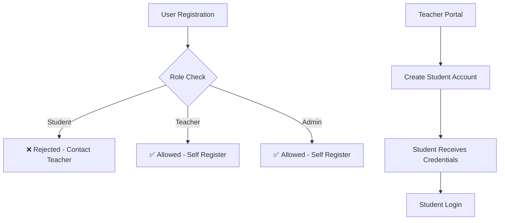

# TalentLens - Architecture Overview

## Project Structure

```
TalentLens/
├── README.md                     # Main project documentation
├── docker-compose.yml           # Docker orchestration
├── backend/                     # Django REST API
│   ├── apps/                   # Django applications
│   │   ├── authentication/    # User authentication & authorization
│   │   ├── interviews/        # Interview management
│   │   ├── users/            # User management
│   │   ├── dashboard/        # Dashboard analytics
│   │   ├── resumes/         # Resume management
│   │   ├── notifications/   # Real-time notifications
│   │   └── ai_engine/       # AI services integration
│   └── talentlens/    # Django project settings
├── clients/                 # Frontend applications
│   ├── shared/             # Shared components & utilities
│   │   ├── api/           # API service layer
│   │   ├── contexts/      # React contexts (Auth, etc.)
│   │   ├── types/         # TypeScript type definitions
│   │   └── utils/         # Utility functions
│   ├── student-ui/        # Student portal (Port 3001)
│   ├── teacher-ui/        # Teacher portal (Port 3002)
│   └── admin-ui/          # Admin dashboard (Port 3003)
├── scripts/               # Development & deployment scripts
│   ├── start-development.sh  # Start all services
│   └── project-setup.sh      # Initial project setup
└── docs/                  # Project documentation
    ├── DEVELOPMENT_PROGRESS.md
    ├── UI_CLIENTS_README.md
    ├── PROJECT_PLAN.md
    └── TEST_RESULTS.md
```

## Architecture Highlights

### 🎯 **Hierarchical Access Control**

- **Students**: Cannot self-register; accounts created by teachers
- **Teachers**: Can self-register; manage student accounts and interviews
- **Administrators**: Full system access; user management

### 🎨 **Role-Based UI Themes**

- **Student UI**: Blue theme (Port 3001)
- **Teacher UI**: Green/Emerald theme (Port 3002)
- **Admin UI**: Purple theme (Port 3003)

### 🔧 **Technology Stack**

- **Backend**: Django REST Framework, SQLite, Channels (WebSocket)
- **Frontend**: Next.js, TypeScript, Tailwind CSS, React Hook Form
- **AI Integration**: Google Gemini API for interview assistance
- **Real-time**: WebSocket notifications and live features

### 🚀 **Key Features**

- AI-powered interview sessions
- Real-time performance analytics
- Resume parsing and management
- Live notifications and chat
- Multi-role authentication system
- Responsive, modern UI design

### 🌐 **Development Ports**

- Backend API: `http://localhost:8000`
- Student Portal: `http://localhost:3001`
- Teacher Portal: `http://localhost:3002`
- Admin Dashboard: `http://localhost:3003`

## Getting Started

1. **Setup**: Run `./scripts/project-setup.sh`
2. **Development**: Run `./scripts/start-development.sh`
3. **Access**: Navigate to appropriate port based on your role

## Authentication Flow


